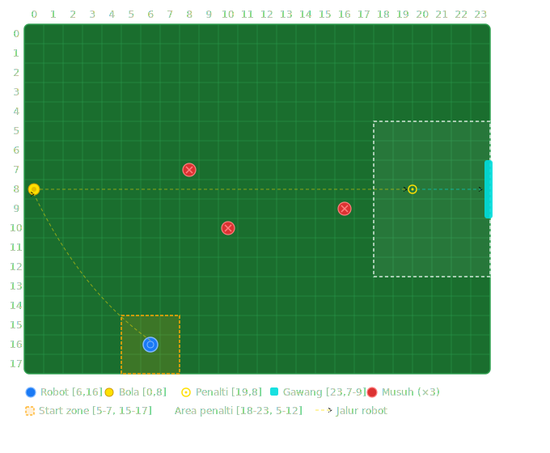

# Artificial-Potential-Field-Algorithm

<div align="center">


**Simulasi robot sepak bola otonom menggunakan metode Artificial Potential Field (APF)**  
dengan kemampuan navigasi dinamis dan penghindaran obstacle real-time.

[Fitur](#-fitur) · [Instalasi](#-instalasi) · [Cara Pakai](#-cara-pakai) · [Algoritma](#️-algoritma)

</div>

---

## 📋 Deskripsi

Proyek ini mengimplementasikan algoritma **Artificial Potential Field (APF)** pada simulasi robot sepak bola otonom. Robot bertugas mengambil bola, membawa ke titik penalti, lalu menendangnya ke gawang — semuanya secara otomatis sambil menghindari musuh yang bergerak secara acak.

Dibuat menggunakan **Python + Pygame** sebagai bagian dari tugas *Design Motion Plans* mata kuliah Perencanaan Gerak Robot.

---

## ✨ Fitur

- 🧠 **Artificial Potential Field** — gaya atraktif ke target + gaya repulsif dari obstacle
- 🛡️ **Smooth Escape** — blend vektor kabur & target saat robot masuk zona bahaya
- 🎯 **State Machine** — tiga fase otomatis: `CHASE_BALL → GO_PENALTY → SHOOT`
- 👾 **Musuh Dinamis** — 3 obstacle bergerak acak setiap 18 frame
- 🔵 **Trace Path** — jejak visual pergerakan robot
- 📐 **Grid 24×18** — lapangan terstruktur dengan nomor kolom & baris
- 🔁 **Replay** — tekan `SPACE` setelah gol untuk mengulang

---

## 🗺️ Peta Lapangan



| Elemen | Grid | Keterangan |
|--------|------|------------|
| 🔵 Robot | `[6, 16]` | Agen utama, dikendalikan APF |
| 🟡 Bola | `[0, 8]` | Target pertama robot |
| ⚪ Titik Penalti | `[19, 8]` | Posisi tembak |
| 🟦 Gawang | `[23, 8]` | Target akhir |
| 🔴 Musuh ×3 | Dinamis | `[8,7]` `[10,10]` `[16,9]` |
| 🟠 Start Zone | `[5–7, 15–17]` | Area awal robot |

---

## 🚀 Instalasi

### Prasyarat

- Python 3.8 atau lebih baru
- pip

### Clone & Install

```bash
# Clone repository
git clone https://github.com/TegarAdh/Artificial-Potential-Field-Algorithm.git
cd Artificial-Potential-Field-Algorithm

# Install dependensi
pip install pygame
```

### Jalankan

```bash
python main.py
```

---

## 🎮 Cara Pakai

| Aksi | Kontrol |
|------|---------|
| Mulai simulasi | Otomatis saat program dijalankan |
| Ulangi setelah gol | `SPACE` |
| Keluar | Tutup window / `Alt+F4` |

---

## ⚙️ Algoritma

### Artificial Potential Field (APF)

Robot diperlakukan sebagai partikel yang dipengaruhi dua gaya:

**Gaya Atraktif** — menarik robot ke target:
```
F_att = k_att × (P_target − P_robot)
```

**Gaya Repulsif** — mendorong robot menjauh obstacle (aktif jika `d < ρ₀`):
```
F_rep = k_rep / d² × (P_robot − P_obstacle) / d
```

**Smooth Escape** — aktif saat robot di zona bahaya (`d < SAFE_RADIUS`):
```
V = normalize(α × V_escape + (1−α) × V_target)
```

### State Machine

```
[START] ──► CHASE_BALL ──► GO_PENALTY ──► SHOOT ──► [GOAL]
               ▲                                        │
               └──────────────── SPACE ────────────────┘
```

### Parameter

| Parameter | Nilai | Keterangan |
|-----------|-------|------------|
| `ROBOT_SPEED` | `3.2` | Piksel per frame |
| `BALL_SPEED` | `10` | Piksel per frame |
| `ATTRACTIVE_GAIN` | `1.0` | Penguatan gaya atraktif |
| `REPULSIVE_GAIN` | `25,000` | Penguatan gaya repulsif |
| `REPULSIVE_RANGE` | `2.2 × CELL_W` | Jarak aktivasi gaya tolak |
| `SAFE_RADIUS` | `1.6 × CELL_W` | Radius zona bahaya |
| `ESCAPE_BLEND` | `0.72` | Bobot kabur vs target |

---

## 🔬 Tentang Metode APF

APF dipilih karena:

1. **Real-time** — perhitungan analitik per frame, cocok untuk simulasi 60 FPS
2. **Responsif** — gaya repulsif dihitung ulang tiap frame sesuai posisi musuh saat ini
3. **Ringan** — tidak butuh graf atau pohon pencarian eksplisit
4. **Smooth Escape** — mengatasi masalah osilasi di sekitar obstacle

> ⚠️ **Limitasi:** APF rentan terhadap *local minima* pada environment dengan banyak obstacle tertutup. Untuk kasus tersebut, dapat dikombinasikan dengan RRT atau metode lainnya.

---

## 📄 Lisensi

Proyek ini dilisensikan di bawah [MIT License](LICENSE).

---

<div align="center">
Dibuat oleh <a href="https://github.com/TegarAdh"><strong>TegarAdh</strong></a> · 2026
</div>
